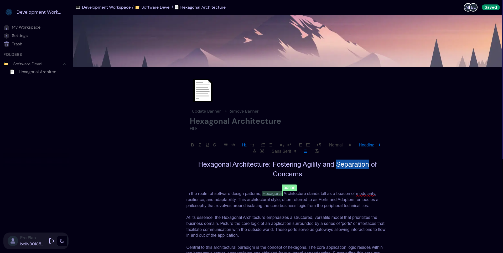

# Cypress | Notion Clone

This is a Next.js project bootstrapped with `pnpm create next-app --typescript`.

## Features

⚡️ Next.js v14\
⚡️ Supabase\
⚡️ Drizzle ORM\
⚡️ Socker.IO\
⚡️ TailwindCSS\
⚡️ Shadcn UI\
⚡ Docker

## Getting Started

### .env

Create `.env` file based on `.env.template`

### Run the development server with Docker 🐳 :

```bash
# install pnpm
npm i -g pnpm

# install deps
pnpm i

# run docker contaniers
docker compose -f docker-compose.dev.yml up --build

# run dev server
pnpm run dev

# stop and remove containers & networks
docker compose -f docker-compose.dev.yml down

```

### Run the production server with Docker 🐳 :

```bash
# run db
docker compose -f docker-compose.dev.yml up --build

# Executing SEED: HTTP Get request
curl http://localhost:3000/api/seed

# docker compose
docker compose up --build -d

```

## View demo

To see the real-time behavior you can log in with:

- User: `adrian@test.com` and password `123123`
- User: `beliv80185@nexxterp.com` and password `123123`

<a href="https://cypress-clone-notion-production.up.railway.app" target="_blank">Demo</a>

### Screenshots


